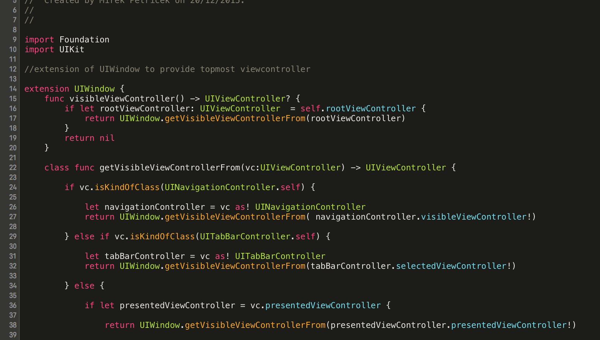

# mirekstheme
This is my favourite Menlo-font based retina optimised dark Xcode theme. It looks like this:



## To install:

```shell
git clone https://github.com/mirekp/mirekstheme.git
mkdir -p ~/Library/Developer/Xcode/UserData/FontAndColorThemes/
cp mirekstheme/Mireks.dvtcolortheme ~/Library/Developer/Xcode/UserData/FontAndColorThemes
cp mirekstheme/Mireks.xccolortheme ~/Library/Developer/Xcode/UserData/FontAndColorThemes
```
